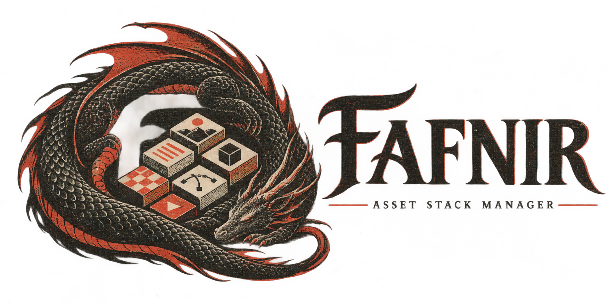

<p align="center">
  
</p>

<p align="center">
  <strong>A local-first MCP tool that turns the Unity assets you already own into an implementation stack.</strong>
</p>

<p align="center">
  <a href="README.md">日本語</a> ｜ English ｜
  <a href="docs/USER_GUIDE.md">Japanese user guide</a> ｜
  <a href="docs/MEDIA_CHECKLIST.md">Media checklist</a>
</p>

Describe the game you want to build. Fafnir retrieves relevant owned assets first and gives Codex or
Claude Code the evidence needed to explain concrete uses, compatibility, missing capabilities, and
alternatives. Only missing roles are supplemented from GitHub, OpenUPM, or purchase-unconfirmed
Asset Store candidates.

> **Alpha:** Recommendation scores are comparison aids, not compatibility, security, or license
> guarantees. Review the Unity version, render pipeline, target platform, license, and project diff
> before adopting a candidate.

## What Fafnir does

- Syncs the signed-in Unity Editor account's complete visible and hidden My Assets list locally.
- Searches English product names from multilingual prompts using a local embedding index.
- Compares candidates with a Unity project's version, render pipeline, Input System, and packages.
- Keeps owned assets, purchase-unconfirmed Asset Store candidates, and GitHub/OpenUPM results in
  separate lanes.
- Inspects cached `.unitypackage` archives without extracting or executing them.
- Exposes evidence through MCP so the client LLM can judge uses and combinations.
- Prepares reviewable, exact-version OpenUPM manifest changes before any write.

Fafnir does not purchase products, export Unity authentication tokens, read cookies, crawl Asset Store
search results, or import Asset Store packages automatically.

## How it fits together

```text
Unity My Assets ─┐
Unity Project ───┼─> Local Fafnir SQLite catalog + RAG index
Public metadata ─┘                    │
                                     ├─> Web UI / CLI
                                     └─> MCP ─> Codex / Claude Code
                                                  │
                                                  └─> Uses, compatibility, gaps
```

Fafnir retrieves and organizes evidence. The MCP client's LLM makes the final design judgment. The
local Web UI is optional when you use MCP.

## Quick start

Python 3.12 or newer is required.

```powershell
git clone https://github.com/TaiyouSun490/FAFNIR-Asset-Stack-Manager.git
cd FAFNIR-Asset-Stack-Manager
py -3.12 -m venv .venv
.\.venv\Scripts\Activate.ps1
python -m pip install -e ".[dev]"
fafnir --version
```

### Sync Unity My Assets

In Unity Package Manager, choose **Add package from disk** and select:

```text
unity_package/com.taiyousun.stackforge/package.json
```

Sign in to Unity Hub/Editor, open **Tools > Fafnir > My Assets Sync**, and click
**My Assetsを同期**. The bridge exports product ID, display name, tags, purchase/grant time, hidden
state, Unity version, and export time. It does not export authentication tokens, cookies, images,
review text, or asset contents.

### Connect Codex

```powershell
codex mcp add fafnir -- fafnir mcp
codex mcp get fafnir
```

For a source checkout, register the environment's Python executable directly:

```powershell
codex mcp add fafnir -- `
  C:\path\to\FAFNIR-Asset-Stack-Manager\.venv\Scripts\python.exe `
  -m game_stack_planner mcp
```

### Connect Claude Code

```powershell
claude mcp add --transport stdio --scope user fafnir -- fafnir mcp
claude mcp get fafnir
```

### Optional Web UI

```powershell
fafnir ui
```

Fafnir opens `http://127.0.0.1:8770/` and listens on loopback only.

### Check indexing

UI or MCP startup downloads the pinned `intfloat/multilingual-e5-small` revision once and builds the
owned-asset index in a background worker.

```powershell
fafnir --json rag-status
```

- `hybrid_dense`: the complete current embedding generation is ready.
- `lexical_fallback`: dense indexing is still preparing; retrieval remains owned-only and lexical.

Fafnir never presents a partial vector generation as dense retrieval.

## Example prompt

```text
Use Fafnir to build an implementation stack for a first-person horror game set in a mountain
observatory isolated by a blizzard. Prioritize assets I own. I need a power outage, a radio-frequency
puzzle, footprints in snow, a visibility-limiting blizzard, a roaming creature, temperature and
inventory management, and checkpoint saves. Explain each asset's role and Unity 6 compatibility,
then supplement only missing capabilities from external sources.
```

Primary MCP tools:

| Tool | Purpose |
| --- | --- |
| `fafnir_status` | Catalog, sync, RAG, and product-metadata status |
| `search_owned_asset_rag` | Semantic retrieval over owned assets |
| `retrieve_game_stack_evidence` | Evidence across the three source lanes |
| `get_unity_asset_candidate` | Evidence for one exact candidate |
| `validate_cached_asset_for_project` | Compare a cached package with a Unity project |
| `prepare_candidate_install` | Produce a reviewable install plan and diff |

## Local data and AI boundaries

| Data | Default location | Sent to an AI client |
| --- | --- | --- |
| Catalog, RAG documents, vectors | `%LOCALAPPDATA%\game-stack-planner\catalog.sqlite3` | Only bounded metadata for retrieved candidates |
| Unity My Assets export | `%LOCALAPPDATA%\game-stack-planner\unity-my-assets.json` | Only bounded metadata when a candidate is returned |
| Embedding model | Local Hugging Face cache | Never |
| Cached `.unitypackage` content | Unity's local cache | No absolute paths, source bodies, or binaries |

The full database, vectors, credentials, local paths, images, and review text are not included in MCP
responses. Retrieved product names, tags, description excerpts, compatibility evidence, and scores may
become part of the connected AI service's model input. Use CLI `--offline` without an external AI
connection when that is not acceptable.

## Current limits

- Recommendations do not guarantee compatibility, security, or license suitability.
- Delisted products without a public page are indexed only from available My Assets fields.
- The Unity Editor bridge adapts an internal Package Manager service and may require future updates.
- Asset Store purchase, download, and import remain manual official-UI operations.
- GitHub candidates are not auto-installed until package root, license, and immutable commit evidence
  can be verified.
- Fafnir does not auto-import `.unitypackage` files into a production project.

## Documentation

- [Japanese user guide](docs/USER_GUIDE.md)
- [Federated source and ownership model](docs/GAME_STACK_FEDERATED_SEARCH.md)
- [Approval-gated installation](docs/GAME_STACK_INSTALLATION.md)
- [Planner details](docs/GAME_STACK_PLANNER.md)
- [RAG implementation status and remaining evaluation](docs/RAG_REMAINING_WORK.md)
- [Brand guide](docs/BRAND.md)
- [Required screenshots and capture guidance](docs/MEDIA_CHECKLIST.md)

The legacy module, data directory, Unity package ID, schema names, and `game-stack` command alias remain
available so existing installations do not require a data migration or resync.

## Development

```powershell
python -m pytest -q
```

## License

[MIT](LICENSE). Unity, Unity Asset Store, GitHub, OpenUPM, and Chrome are products or trademarks of
their respective owners. Fafnir is not affiliated with or endorsed by them.
